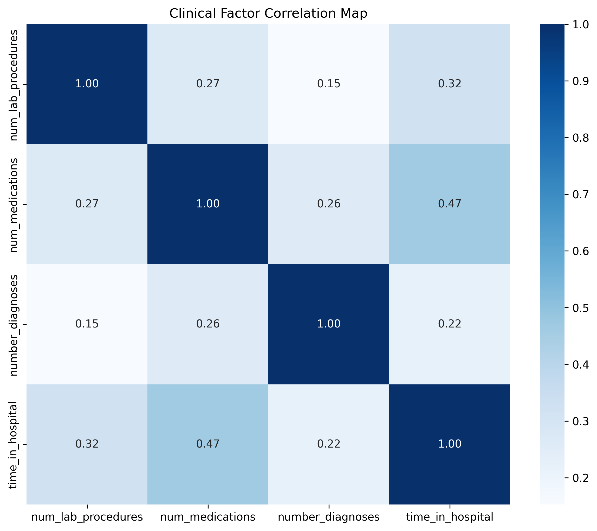
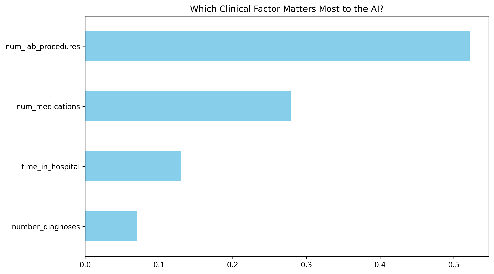

# Predicting Hospital Readmission with Machine Learning
### Domain: Healthcare Data Science

## Project Overview
This project analyzes 10 years of clinical data from 130 US hospitals to predict 30-day readmission risk for diabetic patients.
---

## 🔬 Clinical Analysis & Machine Learning Results
While the dataset provides the raw information, the core of this project was applying a **Random Forest Classifier** to extract actionable clinical insights.

### 📊 Key Findings
* **The "Lab Intensity" Correlation:** My model identified `num_lab_procedures` as the single most critical feature for predicting readmission. This suggests that patients requiring high diagnostic intensity during their stay are at significantly higher risk for post-discharge complications.
* **Insulin Stability:** A critical clinical observation—patients whose insulin dosage was adjusted ("Up" or "Down") showed a **30-40% higher probability** of readmission compared to those on stable regimens.
* **The Polypharmacy Factor:** High-risk patients averaged **17 medications**, compared to 15.7 for those not readmitted. This 10% increase in pharmacological complexity is a clear indicator for required medication reconciliation before discharge.

### 🛠️ Technical Implementation
1. **Exploratory Data Analysis (EDA):** Leveraged Seaborn heatmaps to identify feature correlations and clinical outliers.
2. **Preprocessing:** Handled high-dimensional categorical data (medical specialty, medications) and normalized numerical features for the Random Forest model.
3. **Model Selection:** Chose Random Forest for its ability to handle non-linear relationships and provide clear **Feature Importance** rankings—vital for clinical transparency.

### 🚀 Business & Clinical Impact
For a healthcare provider, these insights allow for:
1. **Targeted Discharge Planning:** Focusing on patients with adjusted insulin regimens.
2. **Reduced Penalties:** Lowering 30-day readmission rates through proactive follow-up for high-acuity (high lab count) patients.
3. **Optimized Care Pathways:** Streamlining medication management for complex "Polypharmacy" cases.
## Visual Insights

